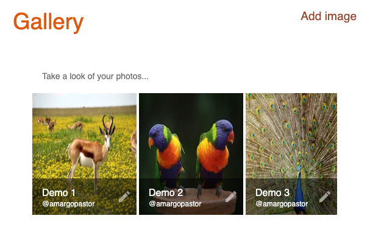

# Gallery Front {


<div align="center" display="flex">
  
</div>

🚀 [Go to API](https://github.com/amargopastor/gallery-api)  

## Table of Contents

1. [Technologies](#technologies)
1. [Libraries](#libraries)
1. [About](#about)
1. [Set Up](#set-up)
1. [Commands Availables](#commands-availables)
1. [Making of](#making-of)
1. [Project tree](#project-tree)
1. [Honorable mentions](#project-tree)

## Technologies

- [NodeJS](https://nodejs.org/)
- [React](https://es.reactjs.org/)
- [Nextjs](https://nextjs.org/)
- [Typescript](https://www.typescriptlang.org/)

## Libraries

- [React-sweet-state](https://github.com/atlassian/react-sweet-state)
- [Eslint](https://eslint.org/)
- [Mui](https://mui.com/)
- [Styled-components](https://styled-components.com/)
- [React-hook-form](https://react-hook-form.com/)

## About

Front end of a gallery project to view, edit and delete images.

## Set Up

To download and start the project you need to run the following commands:

```bash
# Clone the project into your local pc
git clone https://github.com/amargopastor/gallery-front.git

# Move into it
cd gallery-front

# Install all the necessary dependencies (you can check them in the package.json)
yarn install
```

## Commands Availables

Once you've set up the project you're ready to run develop app. Here there are different options:

```bash
# Start the project in dev mode (runs typescript files)
yarn run dev
```

# Making of

Read all about how this project has been made right [here](./docs/README.md).

## Project tree

```
gallery-front
├─ .eslintrc.json
├─ .gitignore
├─ LICENSE
├─ README.md
├─ components
│  ├─ AddForm.tsx
│  ├─ ImagesList.tsx
│  ├─ LoadData.tsx
│  └─ Menu.tsx
├─ doc
│  └─ README.md
├─ lib
│  ├─ fetcher.ts
│  ├─ image_actions.ts
│  ├─ images.ts
│  └─ types.ts
├─ next-env.d.ts
├─ next.config.js
├─ package.json
├─ pages
│  ├─ _app.tsx
│  ├─ add.tsx
│  ├─ edit
│  │  └─ [id].tsx
│  └─ index.tsx
├─ public
│  ├─ default.jpg
│  ├─ demo1.jpg
│  ├─ demo2.jpg
│  └─ demo3.jpg
├─ style
│  └─ theme.config.ts
├─ tsconfig.json
└─ utils
   └─ imageExists.ts
```

## Honorable mentions

🍍

**[⬆ back to top](#table-of-contents)**
