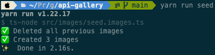
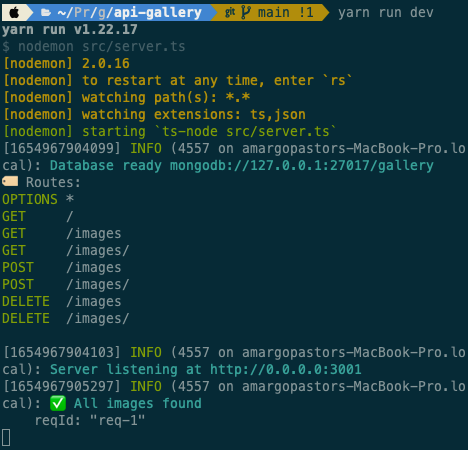

# Making a gallery APP

Para realizar este proyecto de galería de imágenes se ha optado por un enfoque full-stack de microservicios: la aplicación consta de un back en NodeJS compuesto de API con distintos endpoints y un front realizado en REACT y NEXTJS, ambos escritos en Typescript.

> `Microservicio`: cuando tenemos una web con compentencias diversas es una práctica recomendable comenzar a compartimentar en distintas actividades o microservicios. Un servicio puede ser el front (pintado de la web) mientras que otro puede constar de la ejecución de un servidor. De esta manera nuestro proyecto será más mantenible y sencillo de escalar en el tiempo.

## Table of Contents

1. [Backend](#backend)
   1. [Server](#server)
   1. [Images](#images)
   1. [Postman](#postman)
1. [Frontend](#frontend)
   1. [REACT](#react)
   1. [NEXTJS](#nextjs)
   1. [Components](#components)
   1. [State](#state)
   1. [\_app](#app)

## Backend

Comenzamos la aplicación por el back. En lugar de hacer toda una estructura de lógica de proyecto se emplea un enfoque de endpoints: pequeñas API encargas de devolver la información solicitada desde una base de datos para que sea la parte front la encargada de trabajar y pintar la ifnormación. De esta manera hacemos una clara diferenciación en cuanto a competencias y responsabilidades al mismo tiempo que nuestro back se convierte en una herramienta más simplificada y fácil de mantener:

```
api-gallery
├─ .gitignore
├─ README.md
├─ package.json
├─ src
│ ├─ app.ts
│ ├─ bd.ts
│ ├─ config.ts
│ ├─ images
│ │ ├─ Image.model.ts
│ │ ├─ images.api.ts
│ │ └─ seed.images.ts
│ ├─ server.ts
│ └─ types
│ └─ types.ts
├─ tsconfig.json
└─ yarn.lock
```

## Server

La carpeta de source pose todas las piezas clave de nuestro servicio. Se hace especial hincapié en que cada herramienta que emplea este proyecto (servidor, configuraciones, conexiones a bbdd...) este claramente diferenciada en un docuemtno independiente para que sea más fácil de mantener la herramienta en su conjunto:

- `server.ts`: En este fichero se establece una configuración básica del paquete de npm empleado para ejecutar un servidor en local: (fastify)[https://www.npmjs.com/package/fastify].
- `config.ts`: El archivo de configuración esta diseñado para leer las variables de entorno (PORT y DB_URL) con una gramática de typescript y una función checkEnv con carácter defensivo que nos alertará si el desarrollador no ha configurado sus propias variables en el proyecto.
- `bd.ts`: La conexión a la bbdd se realiza en este fichero. Además la conexión devuelve una función close_connection para poder, precisamente, cerrar la conexión con el servidor en el momento que queramos de una manera cómoda.
- `app.ts`: Este es el cuerpo principal de la aplicación. Aquí vamos cargando uno a uno todos los pluggins necesarios sobre nuestro servidor fastify: paquetes de reporte de estado, de cors, rutas principales y rutas específicas.

Una vez que el servidor está correctamente funcionando podemos verificar el mismo empleando la sencilla llamada que encontraremos en `routers/main_router.ts`:

```ts
export const main_router: FastifyPluginAsync = async (app) => {
	app.get('/', async () => ({ hello: 'world' }));
};
```

## Images

Las imágenes de este proyecto conforman en si mismas todo un conjunto de estructura de información y servicios. Por eso poseen su propia carpeta. En esta misma podremos encontrar:

- `Image.model.ts`: Cuando trabajamos con bases de datos no relacionales es importante hacer una buena definición de la estructura que tendrá nuestra data. Por ello mismo empleamos este fichero de modelo dónde estableceremos el esquema que deberán respetar siempre todas las imágenes que se suban al proyecto (nombre del fichero, título, author y userID).
- `seed.images.ts`: Con base en el fichero anterior podemos crear un script que cargue en nuestra bbdd información inicial de prueba sobre la que poder trabajar más adelante en el front. Este fichero seed posee su propia línea de ejecución `yarn run seed` que abre una conexión con nuestra bbdd, limpia toda la data que encuentre, carga 3 imágenes completas y cierra dicha conexión al tiempo que notifica de todo el proceso en la terminal:

<div align="center" display="flex">
  
</div>

- `images.api.ts`: En este fichero encontraremos el CRUD principal de la aplicación. Aquí se definen y ejecutan todas las llamadas `get, post y delete` a nuestra bbdd. Además cada una de las llamdas posee sus propios métodos de alerta de errores tanto en la respuesta del servidor como mediante notificaciones en la consola del desarrollador:

```ts
const images_router: FastifyPluginAsync = async (app) => {
	app.addHook(
		'preHandler',
		async (request: FastifyRequest, reply: FastifyReply) => {}
	);
	app.get('/', list_images);
	app.get('/:_id', get_image);
	app.post('/', new_image);
	app.post('/:_id', update_image);
	app.delete('/', delete_all_image);
	app.delete('/:_id', delete_image);
};
```

<div align="center" display="flex">
  
</div>

## Postman

Si nuestro trabajo es correcto, cuando ejecutemos nuestro servidor con `yarn run dev` en el puerto seleccionado tendremos diponibles toda una serie de endpoints que nos responderán con la data almacenada en nuestra bbdd. Una de las maneras más cómodas de comprobar los resultados es mediante el cliente [postman](https://www.postman.com/): aquí podemos almacenar todas las llamdas que queramos, configurarlas, guardarlas en carpeta e incluso definimar `query parameters ` y estructuras de información en el body de nuestras peticiones.

## Frontend

Una vez desarrollado nuestro back podemos centrarnos en un front que consuma, trabaje y pinte la información almacenada en bbdd. Este apartado de proyecto se ha realizado con [REACT](https://es.reactjs.org/) y [NEXTJS](https://nextjs.org/).

## React

`React` es una librería o framework de frontend especializada en el pintado por pantalla mediante componentens. La principal ventaja de React es que genera su propio DOM (o `DOM en la sombra`): si el DOM creaba un árbol DOM global, el Shadow DOM crea dentro del DOM regular un sub-árbol. Dentro del mismo los nodos HTML, el CSS y el JS son independientes, siendo esta su principal ventaja ya que permite la encapsulación de pequeñas partes del documento. Bajo esta premisa cada vez que un componente de react se actualiza autmáticamente se ejecutará una reconciliación del DOM de aquellos elementos modificados: es decir, ya no es necesario recargar el cliente para apreciar los cambios en la aplicación sino que React se encargará por nosotros de actualizar los componentes modificados.

## NextJS

`NextJS` es un bundler que nos permite crear páginas completamente renderizadas desde el servidor para ser consumidas por el cliente. Dicho de otra manera, NEXTJS nos ayudará a crear páginas con un posicionamiento SEO más eficiente y al mismo tiempo nos facilitará un enrutamiento de nuestros proyectos mucho más sencillo mediante la estructura de carpetas.

## Components

Una de las principales ventajas que posee el framework de React es la creación de entidades visuales o `componentes interactivos y reutilizables`. Dichos componentes aunan un lenguaje de marcado de etiquetas y código javascript que les permite actualizar su contenido sin necesidad de refrescar la página desde el cliente. El concepto de reutilizables es si cabe más importante: un mismo componente bien ejecutado podrá ser empleado cuantas veces queramos a lo largo de nuestro proyecto.

Los componentes que encontraremos en este proyecto son un menú, un formulario para añadir imágenes, una lista de imágenes y un componente especial para la carga de la data (ver más adelante).

## State

Otro de los puntos a destacar de los componentes son sus `propiedades`: variables de información que pueden recibir y que emplearán para pintar una información u otra. Estas propiedades pueden generarse desde cualqueir componente y pasar la data a todos sus descendientes respetando siempre el orden jerárquico del DOM. No obstante, una jerarquía de componentes demasiado extensa puede acabar suponiendo un proyecto dificil de mantener en el tiempo. Es por ello por lo que es siempre recomendable acudir al State.

El State o Estado de la aplicación es un componente especial que almacena toda la información útil para los componetes (nombre de usuario, imágenes disponibles, funciones compartidas...) y que está al alcance de todos ellos mediante sus propios hooks.

En lugar de emplear un hook State se ha optado por emplear una librería sintácticamente más sencilla y fácil de trabar: [react-sweet-state](https://atlassian.github.io/react-sweet-state). El estado general de nuestra aplicación se dividirá en un initialState (`images.ts`) y en una serie de acciones que modificarán dicho estado (`image_actions.ts`).

Estas acciones (load_images, add_image, remove y edit) y la data (o lista de imágenes) estarán disponiles a todos los componentes mediante el hook `useImages()`.

## \_app

Como hemos mencionado antes, una de las ventas de NextJS es la generación de enrutamiento dentro de nuestras aplicación mediante su estructura de carpetas. De esta manera, todos los ficheros que se encuentren dentro de la carpeta pages pasarán a ser rutas navegables del proyecto. Es este aspecto, recibe una mención especial el fichero `_app.ts` ya que constituirá una página compartida por todas las demás páginas de nuestro proyecto, lo que nos permitirá tener un state general, un layout y un CSS global:

```tsx
const App = ({ Component, pageProps }) => (
	<>
		<ThemeProvider theme={lightTheme}>
			<GlobalStyles />
			<header>
				<Menu />
			</header>
			<main>
				<LoadData>
					<Component {...pageProps} />
				</LoadData>
			</main>
		</ThemeProvider>
	</>
);
```
